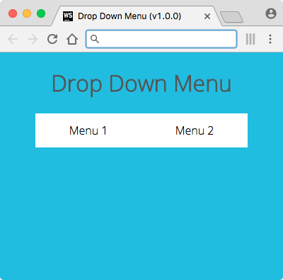
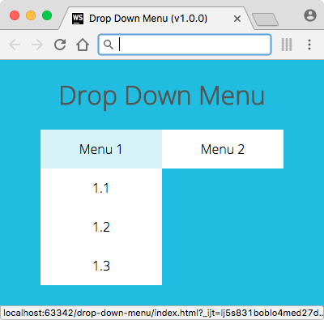
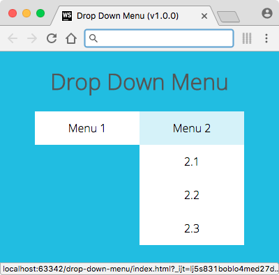

# Drop Menu

v0.3.0

This is a simple drop down menu made with CSS via Sass (version 3.2.12, Media Mark). The Sass-compiled CSS is included, but the logic of how this project is built is explained in the Sass files.

— Roy Vanegas

## Re-Compiling The CSS
1. Compile the CSS document

     `$ sass --unix-newlines --style expanded --watch sass/main.scss:css/main.css`

2. Double-click `index.html`
