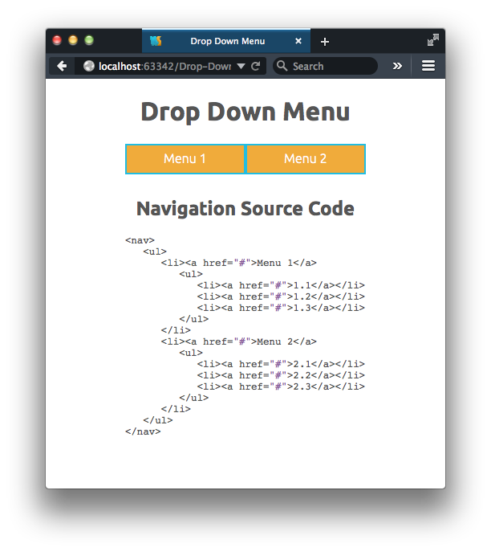

<meta charset="utf-8">
# Drop Menu

This is a simple drop down menu made with Sass (version 3.2.12, Media Mark). It’s thoroughly commented for pedagogical reasons.

— Roy Vanegas (roy@thecodeeducators.com)

## Installation
1. Compile the Sass document

     `$ sass --unix-newlines --style expanded --watch sass/main.scss:css/main.css`

2. Double-click `index.html`
